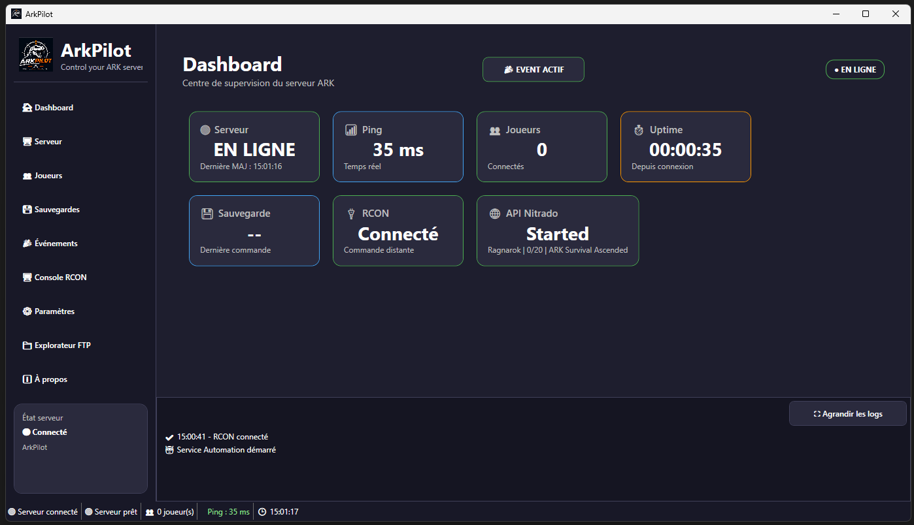
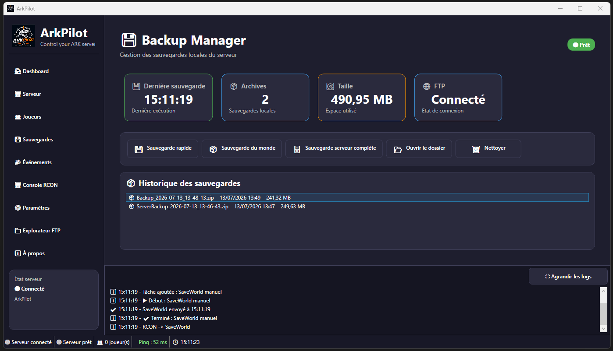

# 🦖 ArkPilot

<p align="center">
  
</p>

<p align="center">


</p>

<p align="center">
  <strong>Control your ARK server.</strong>
</p>

<p align="center">
  Modern Windows manager for <strong>ARK: Survival Ascended</strong> dedicated servers.
</p>

---

## ✨ Features

| Feature | Status |
|---------|:------:|
| Dashboard | ✅ |
| RCON | ✅ |
| FTP Explorer | ✅ |
| World Backups | ✅ |
| Full Server Backups | ✅ |
| ZIP Backups | ✅ |
| Automatic Weekend Events | ✅ |
| Live Logs | ✅ |
| Nitrado API | ✅ |
| Players Management | ✅ |
| Settings | ✅ |

---

## 📸 Screenshots

### Dashboard



### Automatic Events


### Backup Manager



---

## 🚀 Installation

1. Download the latest release.
2. Extract the ZIP archive.
3. Copy:

```text
Templates/appsettings.example.json

```

to:

```text
appsettings.json
```

4. Edit `appsettings.json` with your own:

- Server IP
- RCON password
- Nitrado Service ID
- Nitrado API Token

5. Launch:

```text
ArkPilot.exe
```

ArkPilot is distributed as a **self-contained Windows x64 application**.

No .NET installation is required.

---

## ⭐ Support

If you enjoy using ArkPilot, consider leaving a ⭐ on GitHub.

It helps the project grow and motivates future development.

Thank you for your support!